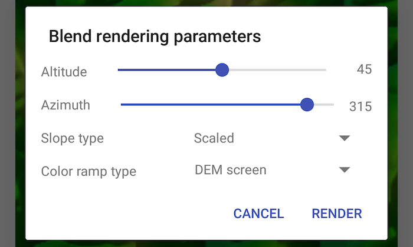

# Blend Renderer

Demonstrates how to use a `BlendRenderer` on a `RasterLayer`. `BlendRenderer` is used to blend elevation data with imagery, creating a 3D effect.

## How to use the sample

Choose and adjust the settings to update the `BlendRenderer` on the `RasterLayer`. To use a `ColorRamp` instead of satellite imagery, choose a `ColorRamp` type.

## How it works

To apply a `BlendRenderer` to a `RasterLayer`:

1. Create a `Raster` from a raster file.
2. Create a `RasterLayer` from the `Raster`.
3. Create a `Basemap` from the `RasterLayer` and set it to the map.
4. Create a `Raster` for elevation from a grayscale raster file.
5. Create a `BlendRenderer`, specifying the elevation `Raster`, `ColorRamp`, and other properties.
	- If you specify a non-null `ColorRamp`, use the elevation `Raster` as the base raster in addition to the elevation raster parameter. That way the `ColorRamp` is used instead of the satellite imagery.
6. Set the `Renderer` on the `RasterLayer` with `rasterLayer.setRenderer(renderer)`.

## Features

- ArcGISMap
- Basemap
- BlendRenderer
- ColorRamp
- MapView
- Raster
- RasterLayer

## Provision your device
1. Download the **TBD.zip** data from [ArcGIS Online](https://TBD).  
2. Extract the contents of the downloaded zip file to disk.  
3. Create an ArcGIS/samples/raster folder on your device. You can use the [Android Debug Bridge (adb)](https://developer.android.com/guide/developing/tools/adb.html) tool found in **<sdk-dir>/platform-tools**.
4. Open up a command prompt and execute the `adb shell` command to start a remote shell on your target device.
5. Navigate to your sdcard directory, e.g. `cd /sdcard/`.  
6. Create the ArcGIS/samples directory, `mkdir ArcGIS/samples/raster`.
7. You should now have the following directory on your target device, `/sdcard/ArcGIS/samples/raster`. We will copy the contents of the downloaded data into this directory. Note:  Directory may be slightly different on your device.
8. Exit the shell with the, `exit` command.
9. While still in your command prompt, navigate to the root folder where you extracted the contents of the data from step 1 and execute the following command: 
	* `adb push TBD/. /sdcard/ArcGIS/samples/raster`
	

	Link | Local Location
	---------|-------|
	|[TBD.zip](TBD)| `<sdcard>`/ArcGIS/samples/raster/Shasta.tif 		  |
	|			   | `<sdcard>`/ArcGIS/samples/raster/Shasta_Elevation.tif |