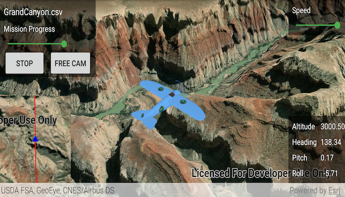

# Animate 3D graphic

An `OrbitGeoElementCameraController` follows a graphic while the graphic's position and rotation are animated.

## How to use the sample

Animation Controls (Top Left Corner):

* Select a mission -- selects a location with a route for plane to fly.
* Mission progress -- shows how far along the route the plane is. Slide to change keyframe in animation.
* Play/Stop -- toggles playing and stopping the animation.
* Follow/Free Cam -- toggles camera following plane.

Speed Slider (Top Right Corner):

* Controls speed of animation.

2D Map Controls (Bottom Left Corner):

* Plus and Minus -- controls distance of 2D view from ground level.

## How it works

1. Create a `GraphicsOverlay` and attach it to the `SceneView`.
1. Create a `ModelSceneSymbol` object.
1. Create a `Graphic` object and set its geometry to a `Point`.
1. Set the `ModelSceneSymbol` object to the graphic.
1. Add heading, pitch, and roll attributes to the graphic. Get the attributes from the graphic with `Graphic.attributes`.
1. Create a `SimpleRenderer` object and set its expression properties.
1. Add graphic and a renderer to the graphics overlay.
1. Create a `OrbitGeoElementCameraController` which is set to target the graphic.
1. Assign the camera controller to the `SceneView`.
1. Update the graphic's location, heading, pitch, and roll.

## Relevant API

* ArcGISScene
* Camera
* GlobeCameraController
* Graphic
* GraphicsOverlay
* ModelSceneSymbol
* OrbitGeoElementCameraController
* Renderer
* SceneProperties
* SceneView
* SurfacePlacement

#### Tags
animation, camera, heading, pitch, roll, rotation, visualize
