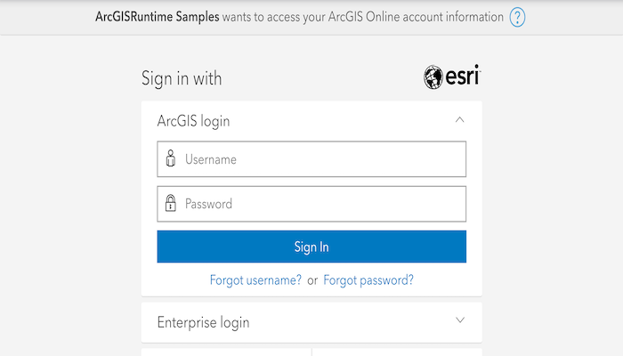

# Authenticate with OAuth

This sample demonstrates how to authenticate with ArcGIS Online (or your own portal) using OAuth2 to access secured resources (such as private web maps or layers). Accessing secured items requires logging in to the portal that hosts them (an ArcGIS Online account, for example).

## Use case

Your app may need to access items that are only shared with authorized users. For example, your organization may host private data layers or feature services that are only accessible to verified users. You may also need to take advantage of premium ArcGIS Online services, such as geocoding or routing services, which require a named user login.

## How to use the sample

1. When you run the sample, the app will load a web map which contains premium content. You will be challenged for an ArcGIS Online login to view the private layers.
1. Enter a user name and password for an ArcGIS Online named user account (such as your ArcGIS for Developers account).
4. If you authenticate successfully, the traffic layer will display, otherwise the map will contain only the public basemap layer.
5. You can alter the code to supply OAuth configuration settings specific to your app.

## How it works

1. When the app loads, a web map containing premium content (world traffic service) is attempted to be loaded in the map view.
1. In response to the attempt to access secured content, the `AuthenticationManager` shows an OAuth authentication dialog from ArcGIS Online.
1. If the user authenticates successfully, the private layers will display in the map.

## Relevant API

 * AuthenticationManager
 * AuthenticationChallengeHandler
 * OAuthConfiguration
 * PortalItem
 
## Additional information

For additional information on using Oauth in your app, see the [Mobile and Native Named User Login](https://developers.arcgis.com/documentation/core-concepts/security-and-authentication/mobile-and-native-user-logins/) topic in our guide.

#### Tags
Cloud & Portal
Authentication
Security
OAuth
Credential
