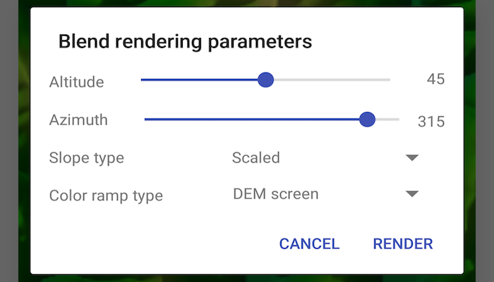

# Blend renderer

Blend a hillshade with a raster by specifying the elevation data. The resulting raster looks similar to the original raster, but with some terrain shading, giving it a textured look.

## Use case

`BlendRenderer` can be used to apply a color ramp to a hillshade to emphasize areas of high or low elevation. A `BlendRenderer` can also be used to add a hillshade effect to aerial or satellite imagery, thereby making changes in elevation more visible.

## How to use the sample

Choose and adjust the altitude, azimuth, slope type and color ramp type settings to update the image.

## How it works

1. Create a `Raster` object from a raster file.
2. Create a `RasterLayer` object from the raster.
3. Create a `Basemap` object from the raster layer and set it to the map.
4. Create another `Raster` object for elevation from a grayscale raster file.
5. Create a `BlendRenderer` object, specifying the elevation raster, color ramp, and other properties.
	- If you specify a non-null color ramp, use the elevation raster as the base raster in addition to the elevation raster parameter. That way, the color ramp is used instead of the satellite imagery.
6. Set the blend renderer to the raster layer.

## Relevant API

* BlendRenderer
* ColorRamp
* Raster
* RasterLayer

## Offline data
1. Download the **shasta-elevation.zip** data from [ArcGIS Online](https://arcgisruntime.maps.arcgis.com/home/item.html?id=caeef9aa78534760b07158bb8e068462).  
2. Extract the contents of the downloaded zip file to disk.  
3. Create an ArcGIS/samples/raster folder on your device. You can use the [Android Debug Bridge (adb)](https://developer.android.com/guide/developing/tools/adb.html) tool found in **<sdk-dir>/platform-tools**.
4. Open up a command prompt and execute the `adb shell` command to start a remote shell on your target device.
5. Navigate to your sdcard directory, e.g. `cd /sdcard/`.  
6. Create the ArcGIS/samples directory, `mkdir ArcGIS/samples/raster`.
7. You should now have the following directory on your target device, `/sdcard/ArcGIS/samples/raster`. We will copy the contents of the downloaded data into this directory. Note:  Directory may be slightly different on your device.
8. Exit the shell with the, `exit` command.
9. While still in your command prompt, navigate to the root folder where you extracted the contents of the data from step 1 and execute the following command:
	`adb push shasta-elevation/. /sdcard/ArcGIS/samples/raster`

	Link | Local Location
	---------|-------|
	|[shasta-elevation.zip](https://arcgisruntime.maps.arcgis.com/home/item.html?id=caeef9aa78534760b07158bb8e068462)| `<sdcard>`/ArcGIS/samples/raster/Shasta.tif 		  |
	|			   | `<sdcard>`/ArcGIS/samples/raster/Shasta_Elevation.tif |

## Tags

color ramp, elevation, hillshade, image, raster, raster layer, visualization
