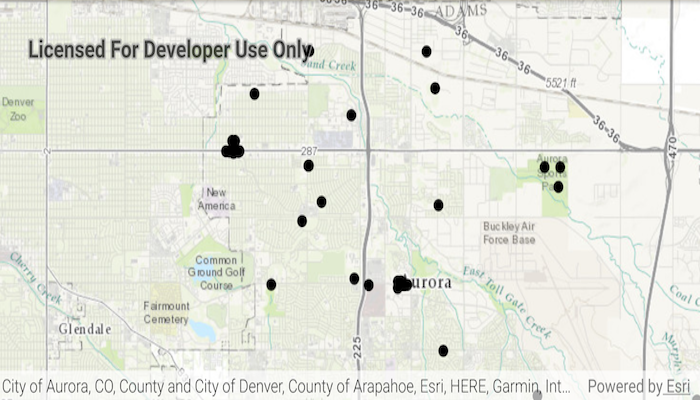

# Feature layer (GeoPackage)
This sample demonstrates how to open a GeoPackage and show a GeoPackage feature table in a feature layer.



## Features
- FeatureLayer
- FeatureTable
- GeoPackage

## Provision your device
1. Download the data from [ArcGIS Online](https://www.arcgis.com/home/item.html?id=68ec42517cdd439e81b036210483e8e7).
2. Extract the contents of the downloaded zip file to disk.
3. Create an ArcGIS/samples/GeoPackage folder on your device. You can use the [Android Debug Bridge (adb)](https://developer.android.com/guide/developing/tools/adb.html) tool found in **<sdk-dir>/platform-tools**.
4. Open up a command prompt and execute the ```adb shell``` command to start a remote shell on your target device.
5. Navigate to your sdcard directory, e.g. ```cd /sdcard/```.
6. Create the ArcGIS/samples/MapPackage directory, ```mkdir ArcGIS/Samples/GeoPackage```.
7. You should now have the following directory on your target device, ```/sdcard/ArcGIS/Samples/GeoPackage```. We will copy the contents of the downloaded data into this directory. Note:  Directory may be slightly different on your device.
8. Exit the shell with the, ```exit``` command.
9. While still in your command prompt, navigate to the folder where you extracted the contents of the data from step 1 and execute the following command:
* ```adb push AuroraCO.gpkg /sdcard/ArcGIS/Samples/GeoPackage```


Link | Local Location
---------|-------|
|[Aurora CO GeoPackage](https://www.arcgis.com/home/item.html?id=68ec42517cdd439e81b036210483e8e7)| `<sdcard>`/ArcGIS/samples/GeoPackage/AuroraCO.gpkg|
