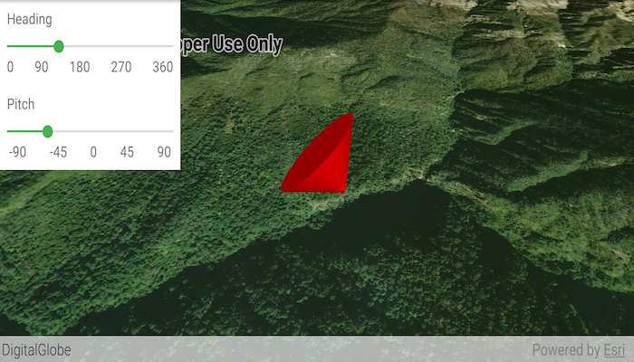

# Scene property expressions

Update the orientation of a graphic using expressions based on its attributes.

## Use case

Instead of reading the attribute and changing the rotation on the symbol
for a single graphic (a manual CPU operation), you can bind the rotation
to an expression that applies to the whole overlay (an automatic GPU
operation). This usually results in a noticeable performance boost
(smooth rotations).

## How to use the sample

Use the seek bars to adjust the heading and pitch properties for the
graphic.

## How it works

Simple renderers can dynamically update the positions of graphics using
an expression. The expression relates a renderer property to one of the
graphic's attribute keys.

1. Create a new `GraphicsOverlay`. 
2. Create a new `SimpleRenderer` and set its scene properties.
3. Set the heading expression to `[HEADING]` and the pitch expression to
   `[PITCH]`.
4. Apply the renderer to the graphics overlay.
5. Create a new `Point` and a new `Graphic` and add it to the overlay.
6. To update the graphic's rotation, update the `HEADING` or `PITCH`
   property in the graphic's attributes.
       
## Relevant API

* GraphicsOverlay
* SimpleRenderer
* SceneProperties 
* SimpleRenderer.SceneProperties
* SceneProperties.HeadingExpression
* SceneProperties.PitchExpression
* Graphic.Attributes

#### Tags
Search and Query
