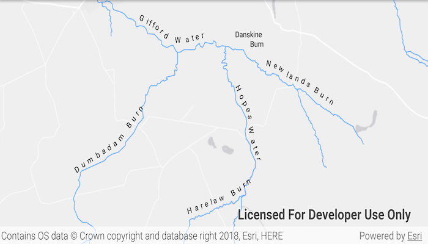

# Display annotation

Display annotation from a feature service URL.

## Use case

Annotation can be used to provide stable size and orientation of river names on a map.

## How to use the sample 

Pan and zoom to see names of waters and burns in a small region of Scotland. The annotation layer contains two sublayers which were set by the author to only be visible within the following scale ranges:

* Water (1:50,000 - 1:100,000)
* Burn (1:25,000 - 1:75,00)

## How it works

1. Create an `ArcGISMap` with a light gray canvas and a viewpoint near the data.
3. Create an `AnnotationLayer` showing from a feature service URL. NOTE: Annotation is only supported from feature services hosted on an [ArcGIS Enterprise](https://enterprise.arcgis.com/en/) server.
4. Add both layers to the operation layers of the map and add it to a `MapView`.

## Relevant API

* AnnotationLayer
* FeatureLayer

## About the data 

Data derived from [OS OpenRivers](https://www.ordnancesurvey.co.uk/business-government/products/open-map-rivers). Contains OS data © Crown copyright and database right 2018.

## Additional information

Annotation is useful for displaying text that you don't want to move or resize when the map is panned or zoomed (unlike labels which will move and resize). An author of annotation data can therefore select the exact, position, alignment, font style and so on. They may choose to do this for cartographic reasons or because the exact placement of the text is important.

## Tags

annotation, cartography, labels, text, utility
