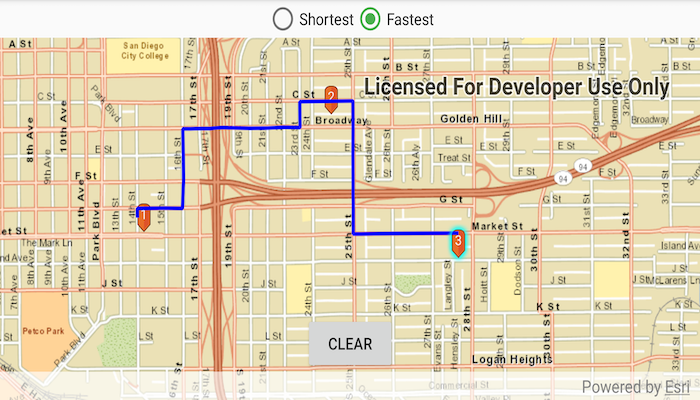

# Offline routing

Solve a route on-the-fly using offline data.

## Use case

You can use an offline network to enable routing in disconnected scenarios. For example, you could provide offline location capabilities to field workers repairing critical infrastructure in a disaster when network availability is limited.

## How to use the sample

Tap once near a road to add a stop to the map. A number graphic will show its order in the route. After adding at least 2 stops, a route will display. Choose "Fastest" or "Shortest" from the switch at the top of the screen to control how the route is optimized. Tap stops to select them, then use a double-touch drag gesture to move them. The route will update on-the-fly while moving stops. The green box marks the boundary of the routable area provided by the offline data.

## How it works

1. Create the map's `Basemap` from a local tile package using a `TileCache` and `ArcGISTiledLayer`.
2. Create a `RouteTask` with an offline locator geodatabase.
3. Get the `RouteParameters` using `routeTask.createDefaultParameters()`.
4. Create `Stop`s and add them to the route task's parameters.
5. Solve the `Route` using `routeTask.solveRouteAsync(routeParameters)`.
6. Create a graphic with the route's geometry and a `SimpleLineSymbol` and display it on another `GraphicsOverlay`.

## Offline data

1. Download the data from [ArcGIS Online](https://arcgisruntime.maps.arcgis.com/home/item.html?id=567e14f3420d40c5a206e5c0284cf8fc).
2. Extract the contents of the downloaded zip file to disk.
3. Open your command prompt and navigate to the folder where you extracted the contents of the data from step 1.
4. Execute the following commands:

`adb push streetmap_SD.tpk /sdcard/Android/data/com.esri.arcgisruntime.sample.offlinerouting/files/san_diego/streetmap_SD.tpk`

`adb push sandiego.geodatabase /sdcard/Android/data/com.esri.arcgisruntime.sample.offlinerouting/files/san_diego/sandiego.geodatabase`

Link | Local Location
---------|-------|
|[San Diego streetmap TPK](https://arcgisruntime.maps.arcgis.com/home/item.html?id=567e14f3420d40c5a206e5c0284cf8fc)| `<sdcard>`/Android/data/com.esri.arcgisruntime.sample.offlinerouting/files/san_diego/streetmap_SD.tpk |
|[San Diego Geodatabase](https://arcgisruntime.maps.arcgis.com/home/item.html?id=567e14f3420d40c5a206e5c0284cf8fc)| `<sdcard>`/Android/data/com.esri.arcgisruntime.sample.offlinerouting/files/san_diego/sandiego.geodatabase |

## About the data

This sample uses a pre-packaged sample dataset consisting of a geodatabase with a San Diego road network and a tile package with a streets basemap.

## Relevant API

* RouteParameters
* RouteResult
* RouteTask
* Stop
* TravelMode

## Tags

connectivity, disconnected, fastest, locator, navigation, network analysis, offline, routing, shortest, turn-by-turn
